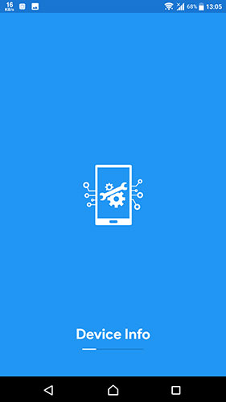
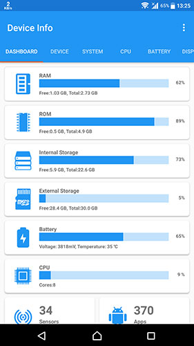
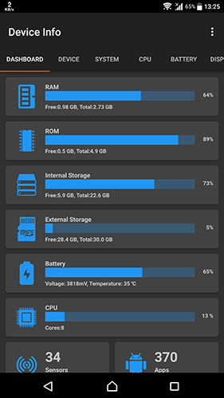

## Device-Info (com.ytheekshana.deviceinfo)
Device Info is a simple and powerful Android application which gives you the complete information about your Mobile device system software and hardware with advanced user interfaces

    
    
    

#### Prerequisites
- Android Studio 3.3
- JDK 1.8
- Android 5+ Device

### Changelog
#### Device Info 1.6.5
- Search apps in app list
- Support development
- Improved UI
- Fixed bugs

#### Device Info 1.5.7
- Uninstall/disable apps directly from app list
- Improved UI
- Fixed bugs
- Migrated to AndroidX

#### Device Info 1.5.6
- Added Light sensor, Bluetooth, Fingerprint & Wi-Fi tests
- Fixed bugs in Flashlight test for Lollipop
- Improved UI

#### Device Info 1.5.0
- Added Service Tests
- Fixed bugs in dark mode
- Improved UI

#### Device Info 1.4.0
- New Splash Screen
- Fixed lag between tabs
- Improved Icon
- Bug fixes

#### Device Info 1.0
- Initial release
