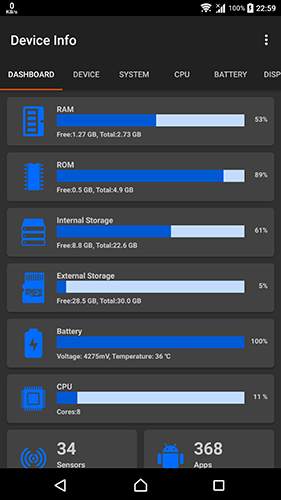

## Device-Info (com.ytheekshana.deviceinfo)
Device Info is a simple and powerful Android application which gives you the complete information about your Mobile device system software and hardware with advanced user interfaces

 

#### Prerequisites
- Android Studio 3.1
- JDK 1.8
- Android 5+ Device

### Changelog
#### Device Info 1.3.0
- Added push notifications
- Dark theme support
- Added sensor information
- Improved CPU information
- Improved storage information
- Bug fixes

#### Device Info 1.2.0
- Some UI tweaks

#### Device Info 1.1.0
- Added application information
- Added external storage information
- Added support to Android Oreo

#### Device Info 1.0
- Initial release
